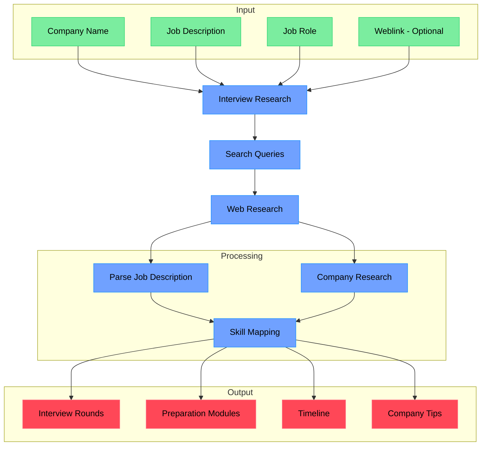

# Interview Preparation Roadmap Generator

An AI-powered research assistant that generates comprehensive interview preparation roadmaps by analyzing company information, job descriptions, and role requirements. The system uses Google's Gemini AI model to create structured roadmaps with specific preparation modules, difficulty levels, and timelines.

This tool specializes in helping job candidates prepare for interviews by providing detailed research on companies, roles, interview processes, and preparation strategies. It generates comprehensive roadmaps covering interview rounds, required skills, preparation modules, and practical preparation advice.

If you like this project, please consider starring it and giving me a follow on [X/Twitter](https://x.com/dzhng). This project is sponsored by [Aomni](https://aomni.com).

## How It Works



## Features

- **Company-Specific Research**: Uses web search to gather current information about the company
- **Job Description Analysis**: Parses job requirements to identify key skills and topics
- **Structured Roadmap**: Provides organized preparation timeline and difficulty levels
- **Resource Recommendations**: Suggests specific resources for each topic
- **Interview Rounds**: Identifies different types of interview rounds (MCQ, Coding, HR, etc.)
- **Preparation Modules**: Maps skills to specific preparation areas (DSA, OOP, SQL, etc.)
- **Gemini AI Integration**: Uses Google's Gemini 2.0 Flash model for intelligent analysis

## Requirements

- Node.js environment
- API keys for:
  - Google Gemini API (for AI analysis and roadmap generation)
  - Firecrawl API (optional, for web research)

## Setup

### Node.js

1. Clone the repository
2. Install dependencies:

```bash
npm install
```

3. Set up environment variables in a `.env.local` file:

```bash
GOOGLE_GENERATIVE_AI_API_KEY="your_gemini_api_key"
FIRECRAWL_KEY="your_firecrawl_key"  # optional
```

### Docker

1. Clone the repository
2. Rename `.env.example` to `.env.local` and set your API keys

3. Run `docker build -f Dockerfile`

4. Run the Docker image:

```bash
docker compose up -d
```

5. Execute `npm run docker` in the docker service:

```bash
docker exec -it deep-research npm run docker
```

## Usage

### API Endpoint

Start the server:

```bash
npm run api
```

The API will be available at `http://localhost:3051`

#### POST `/api/interview-roadmap`

Generate an interview preparation roadmap:

```bash
curl -X POST http://localhost:3051/api/interview-roadmap \
  -H "Content-Type: application/json" \
  -d '{
    "companyName": "Google",
    "jobDescription": "We are looking for a Software Development Engineer to join our team. You will be responsible for designing, developing, and maintaining scalable software systems. Requirements include strong programming skills in Python/Java, experience with cloud platforms, and knowledge of data structures and algorithms.",
    "jobRole": "SDE-1",
    "weblink": "https://careers.google.com"
  }'
```

#### Response Format

```json
{
  "success": true,
  "roadmap": {
    "company": "Google",
    "role": "SDE-1",
    "rounds": [
      {
        "type": "MCQ",
        "topics": {
          "OS": {
            "difficulty": "medium",
            "preparation_modules": ["Operating Systems", "Process Management"],
            "description": "Questions about operating system concepts, process scheduling, memory management",
            "resources": ["Operating System Concepts", "LeetCode OS problems"]
          }
        },
        "duration": "45 minutes",
        "format": "Online",
        "description": "Multiple choice questions covering computer science fundamentals"
      }
    ],
    "preparation_timeline": {
      "weeks_1_2": ["Review computer science fundamentals"],
      "weeks_3_4": ["Focus on algorithms and data structures"],
      "weeks_5_6": ["Advanced topics and mock interviews"]
    },
    "key_skills": ["Data Structures and Algorithms", "System Design"],
    "company_specific_tips": ["Focus on clean, efficient code"],
    "difficulty_overall": "hard"
  }
}
```

### Command Line Interface

Run the interview preparation research assistant:

```bash
npm start
```

You'll be prompted to:

1. Enter the company name
2. Enter the job description
3. Enter the role/position title
4. Specify research breadth (recommended: 4-8, default: 6)
5. Specify research depth (recommended: 2-4, default: 3)

The system will then:

1. Generate and execute company-specific search queries
2. Process and analyze search results for interview preparation
3. Recursively explore deeper based on findings
4. Generate a comprehensive interview preparation roadmap

## Roadmap Structure

The generated roadmap includes:

- **Company**: Company name
- **Role**: Job role/position
- **Rounds**: Array of interview rounds with:
  - Type (MCQ/Coding/HR/Technical/Project)
  - Topics with difficulty levels and preparation modules
  - Duration and format
  - Description
- **Preparation Timeline**: Week-by-week preparation schedule
- **Key Skills**: Essential skills for the role
- **Company-Specific Tips**: Tailored advice for the company
- **Difficulty Overall**: Overall difficulty assessment

## Configuration

### Environment Variables

- `GOOGLE_GENERATIVE_AI_API_KEY`: Required. Your Google Gemini API key
- `FIRECRAWL_KEY`: Optional. Firecrawl API key for web research
- `FIRECRAWL_BASE_URL`: Optional. Custom Firecrawl endpoint
- `FIRECRAWL_CONCURRENCY`: Optional. Concurrency limit (default: 2)
- `CONTEXT_SIZE`: Optional. Context size for prompt trimming (default: 128000)
- `PORT`: Optional. Server port (default: 3051)

### Concurrency

If you have a paid version of Firecrawl or a local version, feel free to increase the `FIRECRAWL_CONCURRENCY` environment variable so it runs faster.

If you have a free version, you may sometimes run into rate limit errors, you can reduce the limit to 1 (but it will run a lot slower).

## How It Works

1. **Input Processing**
   - Takes company name, job description, role, and optional weblink
   - Generates targeted search queries for company research

2. **Research Process**
   - Performs web searches to gather company-specific information
   - Analyzes job description to extract required skills and responsibilities
   - Researches interview processes and common questions

3. **Roadmap Generation**
   - Maps skills to preparation modules (DSA, OOP, SQL, System Design, etc.)
   - Identifies different interview rounds and their topics
   - Assigns difficulty levels and creates preparation timeline
   - Provides company-specific tips and insights

4. **Output**
   - Returns structured JSON roadmap with all preparation details
   - Includes resources, timelines, and practical advice

## Community implementations

**Python**: https://github.com/Finance-LLMs/deep-research-python

## License

MIT License - feel free to use and modify as needed.
